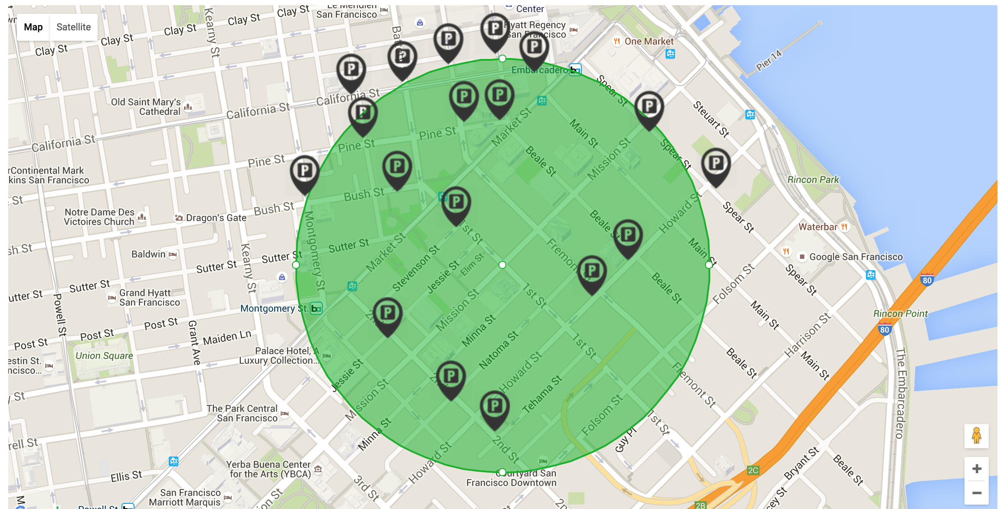
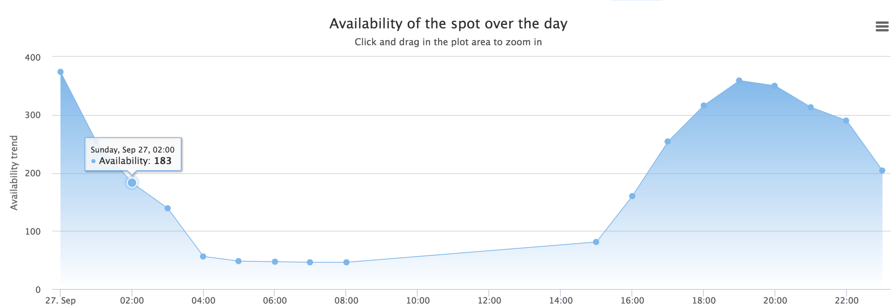
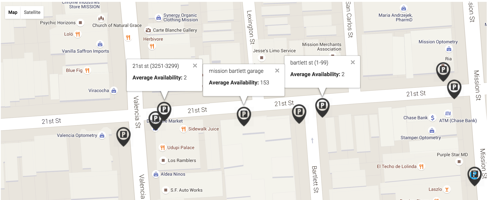
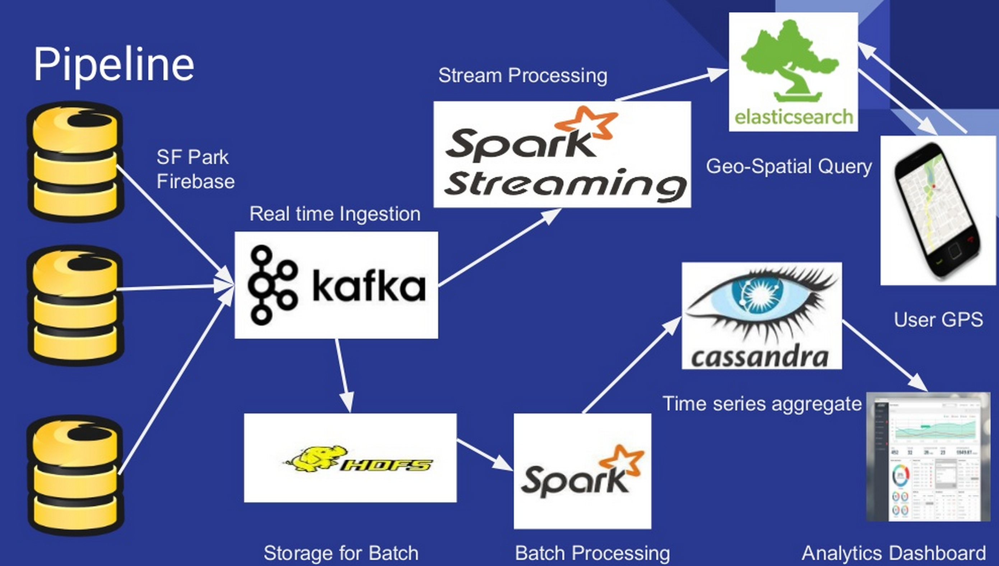

# EasyPark
======================================

## Real-time parking spot recommendation engine 
Demo - [www.EasyPark.xyz](http://EasyPark.xyz)


[Slides](http://www.slideshare.net/chandansaha/parkme-real-time-parking-spot-recommender) 


# What is EasyPark? 

EasyPark is a real time parking spot recommender, which ingests real-time parking sensor data and recommends nearby parking spot to the user based on the availability for San Francisco City. The interface also provides historical analytics to visualize the parking trends on a daily and hourly basis. 

# Technologies Used
 - Data Source
	 - Firebase - Real-time parking sensor data of San Francisco city from SFPark.org
 - Ingestion
	 - Apache Kafka
 - Batch Processing
	 - Apache Spark
	 - Hadoop - HDFS
 - Stream Processing
	 - Spark Streaming
 - Storage
	 - Apache Cassandra (time-series analysis)
	 - Elasticsearch (geo-spatial queries)
 - UI
	 - Flask with Highcharts, Bootstrap and AngularJS
 - Hosting
     - AWS EC2, Heroku


<!--


-->
# EasyPark Approach
EasyPark ingests real-time parking sensor data every 2 seconds, which are processed in the real-time and batch component for real-time parking spot recommendation along with historical hourly and daily parking trend analysis



## Data Source

 - Firebase - real-time parking sensor data from SFpark.org
 - Total of 952 Parking Spots (15 garages and 937 street parking) data are ingested every 2 seconds.
 - Data throughput ~15 GB/day

JSON message fields:

 - timestamp [year month day hour minute second]: time when parking sensor data is generated
 - friendlyName : Name of the parking spot (Ex: 15th Street (1500-1598))
 - open_spaces: Integer representing number of available spots
 -  points [lat, lon]: geographic co-ordinates of the parking spot

## Data Ingestion
JSON messages were consumed from firebase and put into Kafka queue  using the kafka-python package from https://github.com/mumrah/kafka-python.git. Messages were published to a single topic with Spark Streaming and HDFS acting as consumers. 

## Batch Processing
Two batch processes were performed for historical batch views:

 - Analyze parking trends on a hourly granularity
	
	 - Given a date and parking spot name, show the variation of spot availability over the course of the day
 - Analyze parking trends on a daily granularity
	 - Given a date, visualize the average availability of the parking spot at the end of the day

Batch processing is done on data stored in HDFS and the Batch views were directly written into cassandra with the spark-cassandra connector

## Real-time Processing
Messages streamed into Spark Streaming with the spark-kafka connector.
Real-time views were directly written into Elasticsearch in a Map-Reduce fashion.
Depending on the user's location, the parking availability information is constantly updated from Spark Streaming process and utilizing Elasticsearch's geo-spatial query functionality.

## Cassandra Schema
Tables:

1. hourly_location_aggregate: table populated by Spark (batch) representing average hourly parking spot availability information
2. daily_location_aggregate: table populated by Spark (batch) representing average daily parking spot availability information along with individual spot location information
```
CREATE TABLE hourly_location_aggregate (event_time timestamp, spot_name text, availability int, PRIMARY KEY ( (event_time, spot_name) ) );
CREATE TABLE daily_location_aggregate (event_time timestamp, spot_name text, availability int, lat int, lon int PRIMARY KEY ( (event_time, spot_name) ) );
```
## Elasticsearch mapping
``` json
 "EasyPark": {
                "properties": {
                    "location": {
                        "type": "geo_point",
                        "lat_lon": true,
                        "geohash": true
                    }
                }
            }

```
## API calls
Data in JSON format can be displayed in the browser by calling the following endpoints

- get_nearest_spot/[spots]/[lat]/[lon]/
  - retrieve number of parking spots (spots) within 1 mile radius of given lat and lon
- /get_availability_hourly/[date]/[spot_name]
  - retrieve hourly parking trend for the given date and spot name
- /get_availability_daily/[date]
  - retrieve daily parking trends for all the spots for a given date
